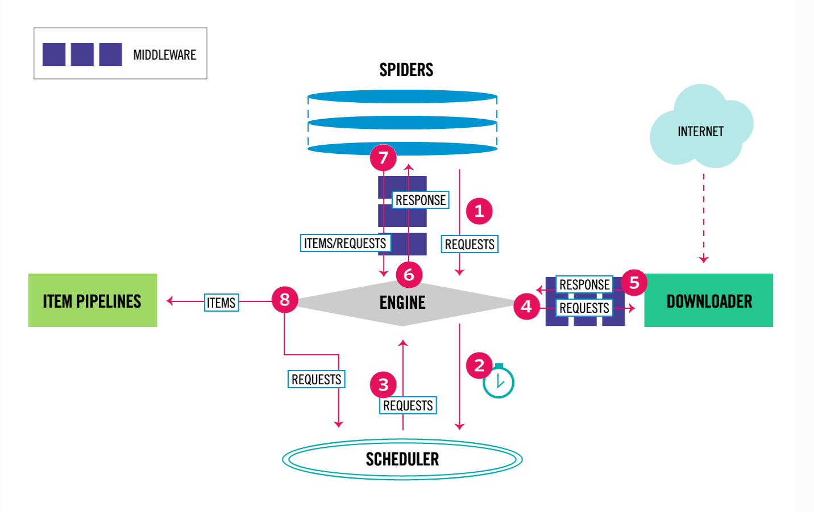
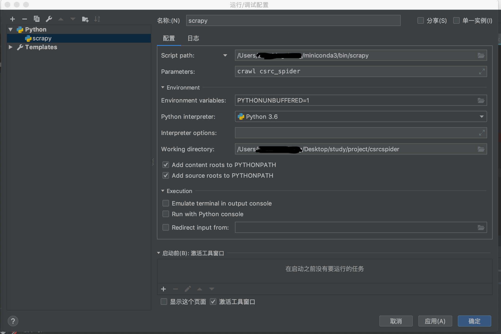

# 证监会信息公开爬虫 说明

__请先阅读[scrapy爬虫工程示例](https://docs.scrapy.org/en/latest/intro/tutorial.html#)__

另外详细的文档说明在[scrapy文档](https://docs.scrapy.org/en/latest/index.html)

## 一、Scrapy简介

### 1、组件和数据流(components and DataFlow)

在编写之前，我们需要了解Scrapy框架中的组件和详细的数据流。



DataFlow的详细流向介绍参看[architecture](https://docs.scrapy.org/en/latest/topics/architecture.html)


## 二、开始在pycharm中调试和编写代码

### 1.pycharm 配置

注意：这仅仅是方便debug采取的做法，这里我是用miniconda的环境



也可以参看[pycharm scrapy debug](https://stackoverflow.com/questions/21788939/how-to-use-pycharm-to-debug-scrapy-projects)

另外:官网文档也给出了一些debug方法,[scrapy_debug](https://docs.scrapy.org/en/latest/topics/debug.html)

### 2.启动 scrapy-splash 镜像

使用这个工具主要是为了动态加载javascript，安装和配置参看[splash文档](./docx/SPLASH_README.rst)

### 3.编写splash lua脚本

文档可以查看[splash文档](https://splash.readthedocs.io/en/stable/index.html)

使用时候有几个难点：

* splash:select中的参数是css选择器，常用的css选择器可以参看[w3c CSS选择器](https://www.w3school.com.cn/cssref/css_selectors.asp)

* splash:runjs, splash:evaljs, splash:jsfunc， 相关调试的时候可以使用chrome的console来调试测试

* 页面加载过程中看到的元素实际上在html中并不存在，例如\<iframe src\>类似的结构，这种类型的需要spash:go重定向到另一个url中再获取数据等。

关于splash的脚本使用测试用例中的test_splash_scripts.py 测试感受！！

着重说下第三点，可以使用测试用例中的test_get_page_document样例看到，当已经把整体页面都点击获取是获得的[debug网页文件](./tests/samples/document_debug.html)，当运行
```lua
local container = splash:select('#documentContainer') 
-- container为nil
```
必须先找到html中存在的iframe结构，运行，并且/execute endpoint不支持获取iframes内容:
```lua
local dataList = splash:select('#DataList') 
```
关于如何获取iframe的内容可以查看测试用例的test_get_redirect_url，同样可以参看[如何动态加载ifame](https://github.com/scrapinghub/splash/issues/413)

### 4.编写scrapy parse方法以及回调

由于scrapy中经常会使用到css选择器，这里面可以参考(css选择器参考手册)[https://www.w3school.com.cn/cssref/css_selectors.asp]

### 5.scrapy 单元测试

参看[scrapy单元测试](https://stackoverflow.com/questions/6456304/scrapy-unit-testing)

## 三、编写过程中的个人思考

### 1、scrapy不同类型的item处理
* 因为爬取的网站有两种类型的item，所以处理的时候需要考虑在pipeline中处理这些数据，具体可以参看[多item讨论1](https://github.com/scrapy/scrapy/issues/1915)

* 另外多个类型的数据在pipeline中处理也可以查看[多item讨论2](https://github.com/scrapy/scrapy/issues/102)

### 2、scrapy PipeLine该如何重写

PipeLine中可以使用的method请看[middleware中的MiddlewareManager](https://github.com/scrapy/scrapy/blob/master/scrapy/middleware.py)
以及[ItemPipelineManager](https://github.com/scrapy/scrapy/blob/master/scrapy/pipelines/__init__.py)看过这部分代码就会发现，
其实pipeline中真正可以使用的方法有三个:"open_spider", "close_spider", "process_item"。

### 3、scrapy去重策略如何重写

去重的流程：
* 1、在Engine拿到request发送给scheduler之前，需要先判断下当前请求是否被过滤

```python
# 源码位置scrapy.core.engine.ExecutionEngine
class ExecutionEngine(object):

    def schedule(self, request, spider):
        self.signals.send_catch_log(signal=signals.request_scheduled,
                request=request, spider=spider)
        # 这里调用scheduler的enqueue_request方法做判断，具体见2
        if not self.slot.scheduler.enqueue_request(request):
            self.signals.send_catch_log(signal=signals.request_dropped,
                                        request=request, spider=spider)
```
* 2、 判断下当前请求是否被过滤的逻辑由scheduler的enqueue_request方法判断

```python
# 源码位置 scrapy.core.scheduler.Scheduler
class Scheduler(object):
    def __init__(self, dupefilter, jobdir=None, dqclass=None, mqclass=None,
                 logunser=False, stats=None, pqclass=None):
        # dupefilter 为具体过滤器，见3.
        self.df = dupefilter
        self.dqdir = self._dqdir(jobdir)
        self.pqclass = pqclass
        self.dqclass = dqclass
        self.mqclass = mqclass
        self.logunser = logunser
        self.stats = stats
        
    """
    """
    
    def enqueue_request(self, request):
        # self.df.request_seen 为过滤器中具体执行过滤的方法逻辑
        # 如果request设置了非不过滤（即过滤，双重否定表肯定）并且该request经过判断以后的确需要过滤，则打印任职并返回False
        if not request.dont_filter and self.df.request_seen(request):
            self.df.log(request, self.spider)
            return False
        if self.stats:
            self.stats.inc_value('scheduler/enqueued/redis', spider=self.spider)
        self.queue.push(request)
        return True
```
* 3、 [scrapy的去重器](https://github.com/scrapy/scrapy/blob/master/scrapy/dupefilters.py)

```python
# 去重启基类，定义了去重器需要实现的方法
class BaseDupeFilter(object):

    pass

# scrapy中默认的去重器
class RFPDupeFilter(BaseDupeFilter):
    """Request Fingerprint duplicates filter"""

    def __init__(self, path=None, debug=False):
        self.file = None
        # 一个指纹集合，利用到了set的特性，不重复
        self.fingerprints = set()
        self.logdupes = True
        self.debug = debug
        self.logger = logging.getLogger(__name__)
        # 这里会判断是否设置了jobdir，如果设置了，则会将去重结合写入到jobdir目录，具体见《scrapy进阶开发（二）：暂停与重启》一文
        if path:
            self.file = open(os.path.join(path, 'requests.seen'), 'a+')
            self.file.seek(0)
            self.fingerprints.update(x.rstrip() for x in self.file)

    @classmethod
    def from_settings(cls, settings):
        # settings中将DUPEFILTER_DEBUG设置为true可以开启过滤debug信息的打印
        debug = settings.getbool('DUPEFILTER_DEBUG')
        return cls(job_dir(settings), debug)

    def request_seen(self, request):
        # 为request生成一个指纹 
        fp = self.request_fingerprint(request)
        # 判断当前指纹是否在集合中
        if fp in self.fingerprints:
            # 如果在返回True代表当前request已经被处理过应该过滤掉
            return True
        # 否则添加到set中
        self.fingerprints.add(fp)
        # 如果jobdir文件存在，则写入
        if self.file:
            self.file.write(fp + os.linesep)

    # request_fingerprint方法在scrapy.utils.request里，
    # 使用了sha1算法为每一个request生成一个固定长度的hash值
    def request_fingerprint(self, request):
        return request_fingerprint(request)

    # 关闭方法
    def close(self, reason):
        if self.file:
            self.file.close()

    # 记录日志的方法封装
    def log(self, request, spider):
        if self.debug:
            msg = "Filtered duplicate request: %(request)s"
            self.logger.debug(msg, {'request': request}, extra={'spider': spider})
        elif self.logdupes:
            msg = ("Filtered duplicate request: %(request)s"
                   " - no more duplicates will be shown"
                   " (see DUPEFILTER_DEBUG to show all duplicates)")
            self.logger.debug(msg, {'request': request}, extra={'spider': spider})
            self.logdupes = False

        spider.crawler.stats.inc_value('dupefilter/filtered', spider=spider)
```

### 4、推荐的进阶博文

* [scrapy源码分析](https://cloud.tencent.com/developer/article/1336103)
* [scrapy暂停与重启](https://cloud.tencent.com/developer/article/1336104)
* [scrapy去重策略](https://cloud.tencent.com/developer/article/1336106)
* [spiderMiddleware](https://juejin.im/post/5af3ee8bf265da0b9348535a)

### 5、遗留的一个问题

在"http://www.csrc.gov.cn/pub/zjhpublic/"中通过点击:

按主题查看 -> 发行监管 -> 预先披露 后，

如果使用splash script去拿到不同页的数据，但是当使用[click_next_page_script脚本](./csrc/examples/test_lua_scripts.py)，会发现点击的下一页404.

## 四、源码阅读

* scrapy中使用了大量回调，例如spider call_back的传递;

* ClassManager的设计思路，在pipelines的设计中很明显;

* 类似于hook（钩子）的编写思路，例如Spider中间件是在引擎及Spider之间的特定钩子,具体定义需要看[contract中的代码](https://github.com/scrapy/scrapy/blob/master/scrapy/dupefilters.py),
实际上detectron2中也采用了类似的钩子编写思路，不过detectron2中的是显式定义的。

* 另外看数据的流向图我们会发现，Scrapy架构呈现星型拓扑结构，“引擎”作为整个架构的核心协调、控制整个系统的运行。

